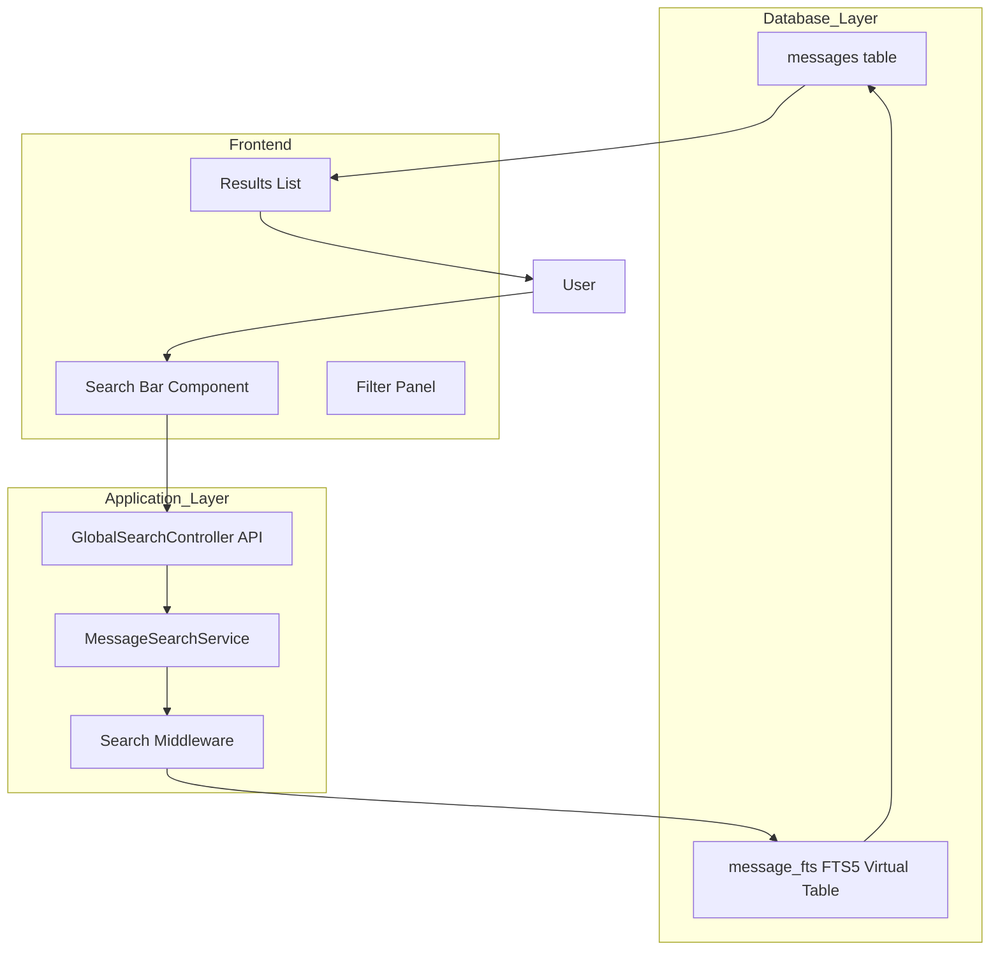

# Spesifikasi Teknis: Fitur Global Message Search

## 1. Gambaran Umum

Dokumen ini menjelaskan spesifikasi teknis untuk implementasi fitur **Global Message Search** pada aplikasi livechat Laravel. Fitur ini memungkinkan pencarian teks lengkap (Full-Text Search) pada seluruh isi riwayat pesan, dengan dukungan filter kategori dan highlighting hasil pencarian.

---

## 2. Arsitektur Sistem



---

## 3. Spesifikasi Database

### 3.1 Struktur Tabel messages (Existing)

| Kolom           | Tipe            | Keterangan                         |
| --------------- | --------------- | ---------------------------------- |
| id              | BIGINT UNSIGNED | Primary key                        |
| conversation_id | BIGINT UNSIGNED | Foreign key ke conversations       |
| sender_id       | BIGINT UNSIGNED | ID pengirim                        |
| sender_type     | ENUM            | 'user', 'admin', 'system'          |
| message_type    | ENUM            | 'text', 'image', 'file', 'whisper' |
| content         | TEXT            | Isi pesan                          |
| is_read         | BOOLEAN         | Status read                        |
| created_at      | TIMESTAMP       | Waktu dibuat                       |
| updated_at      | TIMESTAMP       | Waktu diperbarui                   |

### 3.2 FTS Virtual Table (New)

Menggunakan **MySQL 5.6+ FULLTEXT Index** pada tabel messages:

```sql
-- Membuat FULLTEXT index pada kolom content
ALTER TABLE messages
ADD FULLTEXT INDEX idx_messages_fts (content);

-- Query pencarian FTS
SELECT
    m.*,
    MATCH(m.content) AGAINST(:query IN NATURAL LANGUAGE MODE) AS relevance_score,
    MATCH(m.content) AGAINST(:query IN NATURAL LANGUAGE MODE WITH QUERY EXPANSION) AS relevance_score_expanded
FROM messages m
WHERE MATCH(m.content) AGAINST(:query IN NATURAL LANGUAGE MODE)
ORDER BY relevance_score DESC, m.created_at DESC;
```

### 3.3 Kolom Tambahan untuk Filter

| Kolom          | Tipe             | Default | Keterangan                                    |
| -------------- | ---------------- | ------- | --------------------------------------------- |
| has_media      | BOOLEAN          | false   | Flag untuk pesan dengan media                 |
| media_type     | VARCHAR(20) NULL | -       | Jenis media: 'image', 'video', 'file', 'link' |
| extracted_urls | JSON NULL        | -       | Array URL yang diekstrak dari konten          |

---

## 4. Endpoint API

### 4.1 Global Search Endpoint

```
GET /api/admin/messages/search

Query Parameters:
- q           : string    (wajib) - Kata kunci pencarian
- type        : string    (opsional) - Filter: 'all', 'text', 'image', 'video', 'file', 'link'
- sender_type : string    (opsional) - Filter: 'all', 'user', 'admin', 'system'
- date_from   : date      (opsional) - Tanggal mulai (Y-m-d)
- date_to     : date      (opsional) - Tanggal akhir (Y-m-d)
- conversation_id : bigint (opsional) - Filter percakapan tertentu
- page        : int       (opsional, default: 1)
- per_page    : int       (opsional, default: 20, max: 100)

Response:
{
  "success": true,
  "data": {
    "results": [
      {
        "id": 123,
        "conversation_id": 45,
        "sender_name": "John Doe",
        "sender_type": "user",
        "message_type": "text",
        "content": "Saya ingin bertanya tentang...",
        "highlighted_content": "Saya ingin bertanya tentang <mark>pembayaran</mark>...",
        "created_at": "2026-03-05 10:30:00",
        "conversation_title": "Percakapan #45"
      }
    ],
    "pagination": {
      "current_page": 1,
      "per_page": 20,
      "total": 150,
      "last_page": 8
    },
    "facets": {
      "by_type": {
        "text": 100,
        "image": 30,
        "video": 10,
        "file": 5,
        "link": 5
      },
      "by_sender": {
        "user": 120,
        "admin": 25,
        "system": 5
      }
    }
  }
}
```

### 4.2 Route Definition

```php
// routes/api.php
Route::prefix('admin')->middleware(['auth:admin'])->group(function () {
    Route::get('/messages/search', [GlobalSearchController::class, 'search'])
        ->name('admin.messages.search');
});
```

---

## 5. Logika Pencarian (Service Layer)

### 5.1 MessageSearchService

```php
namespace App\Services;

class MessageSearchService
{
    /**
     * Eksekusi pencarian dengan FTS dan filter
     */
    public function search(array $params): array;

    /**
     * Ekstrak URL dari konten pesan
     */
    private function extractUrls(string $content): array;

    /**
     * Generate highlighted snippet dengan konteks
     */
    private function generateSnippet(string $content, string $query, int $contextWords = 10): string;

    /**
     * Eksekusi query FTS dengan scoring
     */
    private function executeFtsQuery(string $query, array $filters): \Illuminate\Contracts\Pagination\LengthAwarePaginator;
}
```

### 5.2 Algoritma Snippet Generation

```
1. Find posisi keyword dalam konten
2. Ambil 10 kata sebelum dan 10 kata setelah keyword
3. Highlight keyword dengan tag <mark>
4. Tambahkan ellipsis (...) jika ada teks yang dipotong
5. Return snippet dengan maksimal 200 karakter
```

### 5.3 Logika Filter Kategori

| Kategori | Kondisi Query                                                  |
| -------- | -------------------------------------------------------------- |
| Semua    | Tidak ada filter                                               |
| Foto     | message_type = 'image' ATAU extracted_urls CONTAINS gambar     |
| Video    | message_type = 'file' DAN ekstensi video                       |
| Tautan   | extracted_urls IS NOT NULL AND JSON_LENGTH(extracted_urls) > 0 |

---

## 6. Model Relationships

### 6.1 Message Model Extension

```php
class Message extends Model
{
    // Existing fields...

    // New scope for FTS search
    public function scopeFullTextSearch($query, string $searchTerm)
    {
        return $query->whereRaw(
            'MATCH(content) AGAINST(? IN NATURAL LANGUAGE MODE)',
            [$searchTerm]
        );
    }

    // New scope for media filter
    public function scopeHasMedia($query, string $mediaType = null)
    {
        if ($mediaType === 'link') {
            return $query->whereNotNull('extracted_urls');
        }
        return $query->where('message_type', $mediaType);
    }
}
```

---

## 7. Spesifikasi Frontend

### 7.1 Komponen Search Bar

```
┌─────────────────────────────────────────────────────────────┐
│  🔍  | Cari pesan...                      | Filter ▼ |      │
├─────────────────────────────────────────────────────────────┤
│  [Semua] [Foto] [Video] [Tautan]                           │
└─────────────────────────────────────────────────────────────┘
```

### 7.2 Komponen Results List

```
┌─────────────────────────────────────────────────────────────┐
│  Pesan #123 - 5 menit yang lalu                           │
│  Dari: Ahmad (User)                                        │
│  Dalam: Percakapan #45                                     │
│  ─────────────────────────────────────────                 │
│  "Saya ingin bertanya tentang <mark>pembayaran</mark>     │
│   melalui transfer bank..."                                │
│                                                             │
│  📷 [thumbnail jika ada]                                   │
└─────────────────────────────────────────────────────────────┘
```

### 7.3 Highlight Styling

```css
mark {
    background-color: #fef08a; /* yellow-200 */
    color: #854d0e; /* yellow-800 */
    padding: 0.125rem 0.25rem;
    border-radius: 0.125rem;
    font-weight: 600;
}
```

---

## 8. Fitur Tambahan

### 8.1 Auto-Indexing

Setiap kali pesan baru dibuat, otomatisasi indexing:

```php
// Dalam MessageObserver atau listener
public function created(Message $message)
{
    // Ekstrak URL jika ada
    $urls = $this->extractUrls($message->content);
    $message->update([
        'has_media' => !empty($urls) || in_array($message->message_type, ['image', 'file']),
        'extracted_urls' => !empty($urls) ? json_encode($urls) : null,
    ]);
}
```

### 8.2 Search History (Opsional)

Menyimpan riwayat pencarian terakhir untuk setiap admin:

```sql
CREATE TABLE search_history (
    id BIGINT UNSIGNED PRIMARY KEY,
    admin_id BIGINT UNSIGNED NOT NULL,
    query VARCHAR(255) NOT NULL,
    created_at TIMESTAMP DEFAULT CURRENT_TIMESTAMP
);
```

---

## 9. Pertimbangan Performa

| Aspek              | Strategi                                    |
| ------------------ | ------------------------------------------- |
| Indexing           | FULLTEXT index pada kolom content           |
| Caching            | Cache hasil pencarian dengan tag per-query  |
| Pagination         | Cursor-based pagination untuk dataset besar |
| Query Optimization | Gunakan INDEX pada kol                      |

om created_at, conversation_id |
| Rate Limiting | Batasi request hingga 60x per menit per admin |

---

## 10. Test Cases

| #   | Skenario                               | Hasil yang Diharapkan                                             |
| --- | -------------------------------------- | ----------------------------------------------------------------- |
| 1   | Pencarian kata "pembayaran"            | Menampilkan semua pesan mengandung kata "pembayaran"              |
| 2   | Pencarian "pembayaran" + filter "Foto" | Menampilkan pesan dengan gambar yang mengandung kata "pembayaran" |
| 3   | Pencarian kata dengan hasil kosong     | Menampilkan pesan "Tidak ada hasil"                               |
| 4   | Pencarian frasa dengan kutipan         | Pencarian exact match                                             |
| 5   | Filter tanggal range                   | Menampilkan pesan dalam rentang tanggal                           |

---

## 11. Deployment Checklist

- [ ] Jalankan migration untuk kolom tambahan
- [ ] Buat FULLTEXT index pada tabel messages
- [ ] Deploy API endpoint
- [ ] Deploy frontend components
- [ ] Configure rate limiting
- [ ] Test performance dengan dataset besar
- [ ] Dokumentasi penggunaan untuk admin
